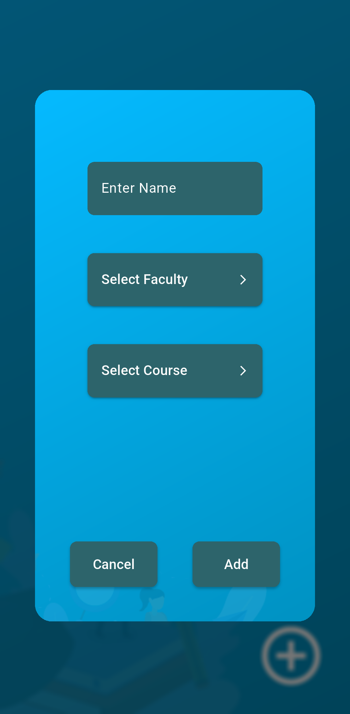
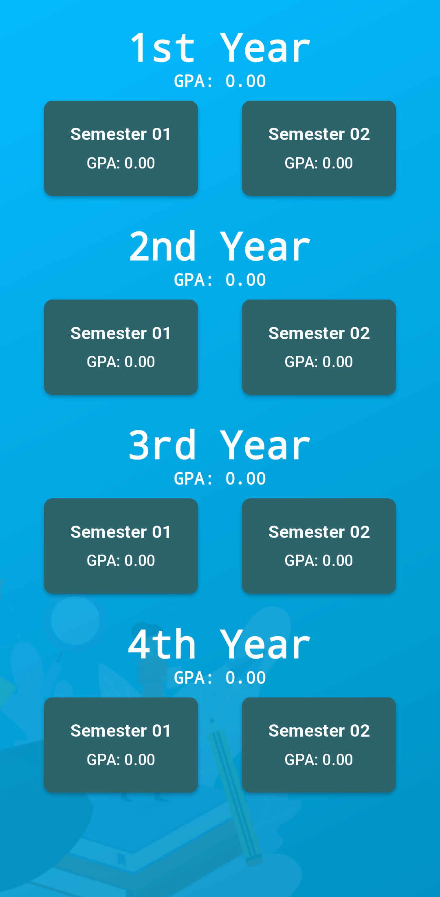
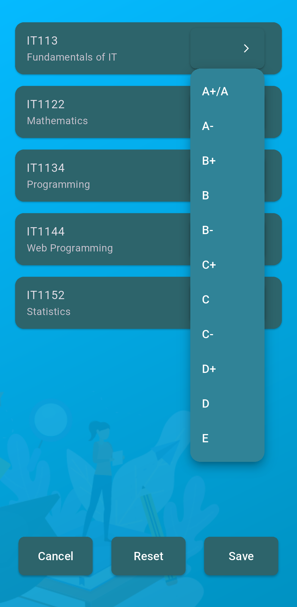
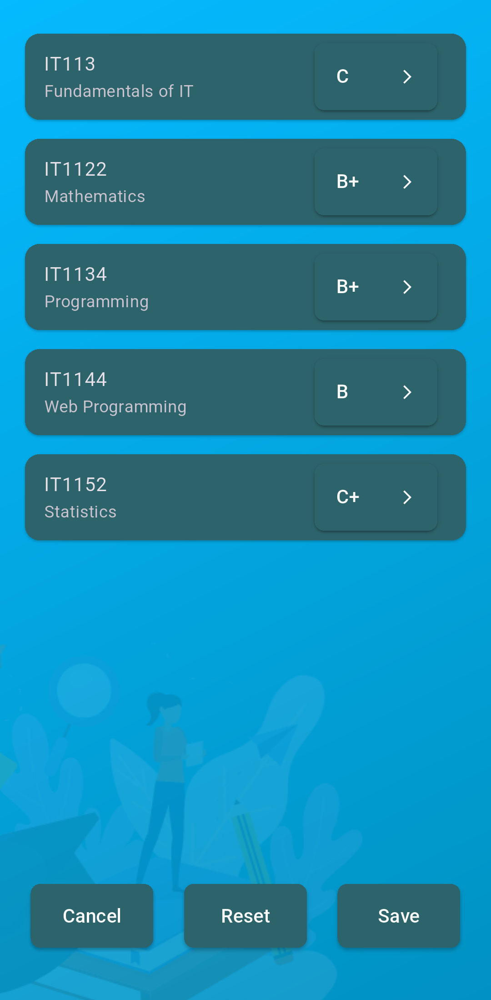
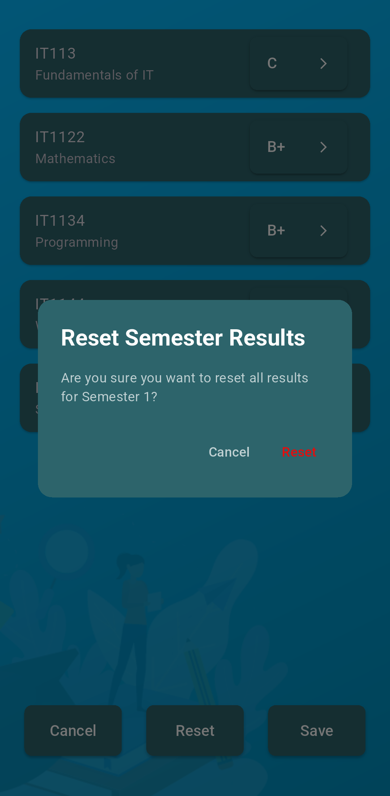
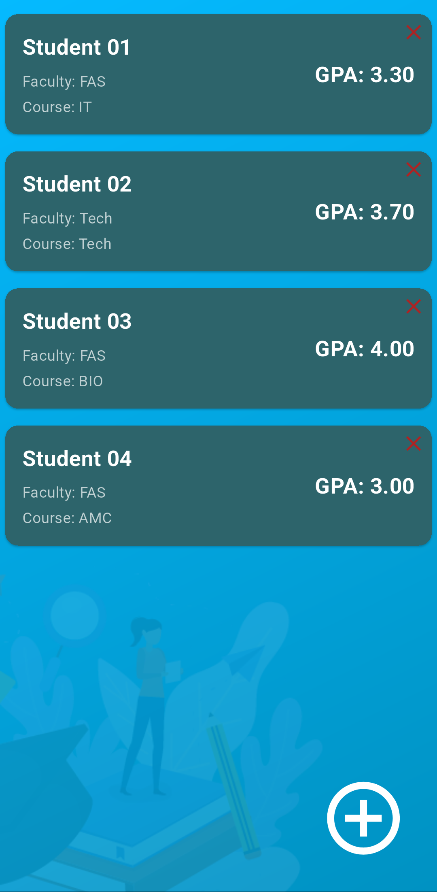
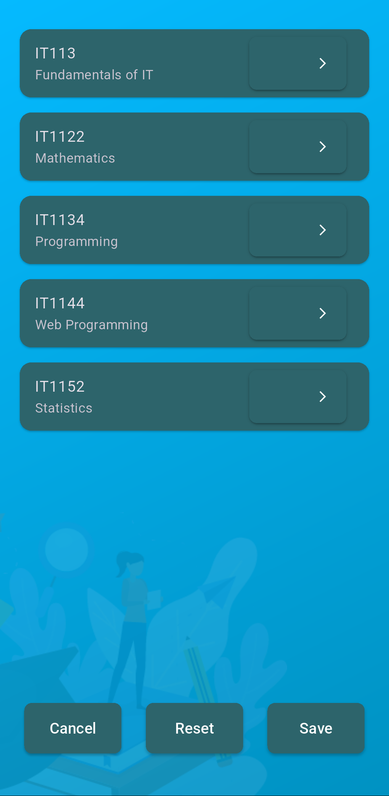

# GPA Calculator Application

A Flutter-based mobile application for calculating and tracking student GPAs. This application helps students manage their academic performance by providing semester-wise and year-wise GPA calculations.

## Features

- **Student Management**
  - Add and manage student profiles
  - Track academic progress
  - View detailed student information

- **GPA Calculation**
  - Semester-wise GPA calculation
  - Year-wise GPA calculation
  - Overall GPA tracking
  - Support for different grading scales

- **Course Management**
  - Comprehensive course database
  - Support for multiple faculties
  - Credit-based GPA calculation
  - Easy grade entry and modification

- **User Interface**
  - Clean and intuitive design
  - Easy navigation between semesters
  - Visual representation of academic performance
  - Responsive layout for different screen sizes

## Screenshots

<table>
  <!-- Row 1 -->
  <tr>
    <td></td>
    <td></td>
    <td></td>
    <td></td>
    <td></td>
  </tr>
  <!-- Row 2 -->
  <tr>
    <td></td>
    <td></td>
    <td></td>
    <td></td>
    <td></td>
  </tr>
</table>


## Getting Started

### Prerequisites

- Flutter SDK (latest version)
- Dart SDK (latest version)
- Android Studio / VS Code
- Android/iOS emulator or physical device

### Installation

1. Clone the repository
```bash
git clone https://github.com/mrnipundilshan/UOV-GPA-TRACKER_APP.git
```

2. Navigate to the project directory
```bash
cd UOV-GPA-TRACKER_APP
```

3. Install dependencies
```bash
flutter pub get
```

4. Run the application
```bash
flutter run
```

## Usage

1. **Adding a Student**
   - Click on the "Add Student" button
   - Fill in student details (name, faculty, course)
   - Save the student profile

2. **Entering Grades**
   - Select a student
   - Choose the semester
   - Enter grades for each course
   - Save the results

3. **Viewing GPAs**
   - Select a student
   - View semester-wise GPAs
   - View year-wise GPAs
   - Check overall GPA

## Database Structure

The application uses SQLite for data storage with the following tables:

- `students`: Stores student information
- `subjects`: Contains course details
- `gpa_results`: Stores grade information
- `student_subjects`: Links students with their subjects

## License

This project is licensed under the MIT License - see the [LICENSE](LICENSE) file for details

## Acknowledgments

- Flutter team for the amazing framework
- SQLite for the database functionality
- All contributors who have helped improve this application

## Contact

Linkedin - [Nipun Dilshan](https://www.linkedin.com/in/nipundilshan/)


